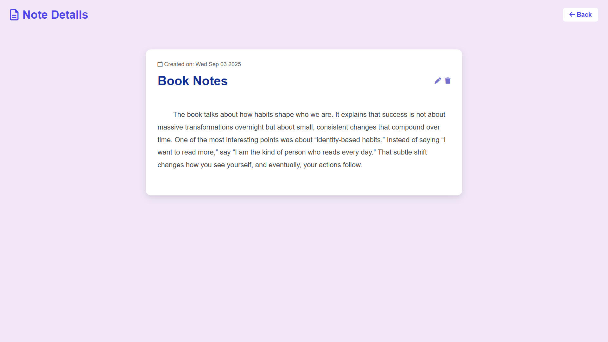
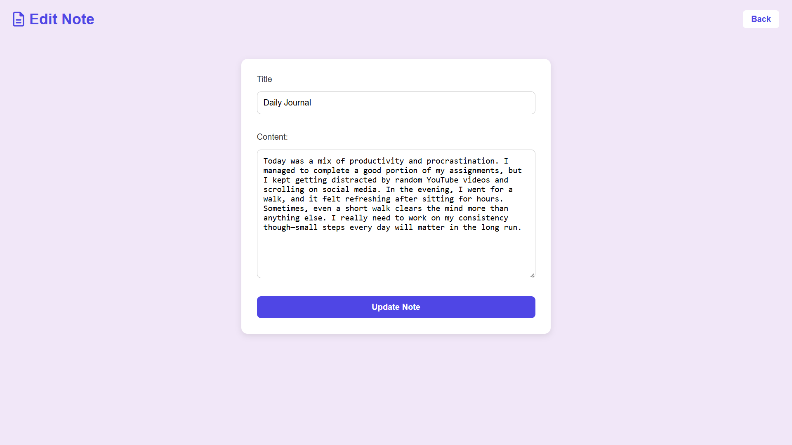

# 📝 Notes App  

A simple **Notes Application** built with **Node.js, Express, MongoDB, and EJS**.  
It allows users to **create, edit, delete, and view notes** with a clean and modern UI.  

---

## 🚀 Features  
- ➕ Add new notes  
- ✏️ Edit existing notes  
- 🗑️ Delete notes  
- 👀 View full note content  
- 📅 Shows note creation date  
- 💾 Stores notes in MongoDB  

---

## 🛠️ Tech Stack  
  
  
  
  
  
  
  

---

## 📸 Preview  

### 🏠 Home Page  
  

### 📄 Single Note  
  

### ➕ Add New Note  
  

---

## 📂 Installation & Setup  

### 1️⃣ Clone the repo  
```bash
git clone https://github.com/shahidx05/Notes-App-Backend
```

### 2️⃣ Go inside the folder
cd Todo-Backend

### 3️⃣ Install dependencies
npm install

### 4️⃣ Setup environment variables

### Create a .env file and add:
MONGODB_URI=your_mongodb_connection_string
PORT=3000

### 5️⃣ Run the server
npm start

